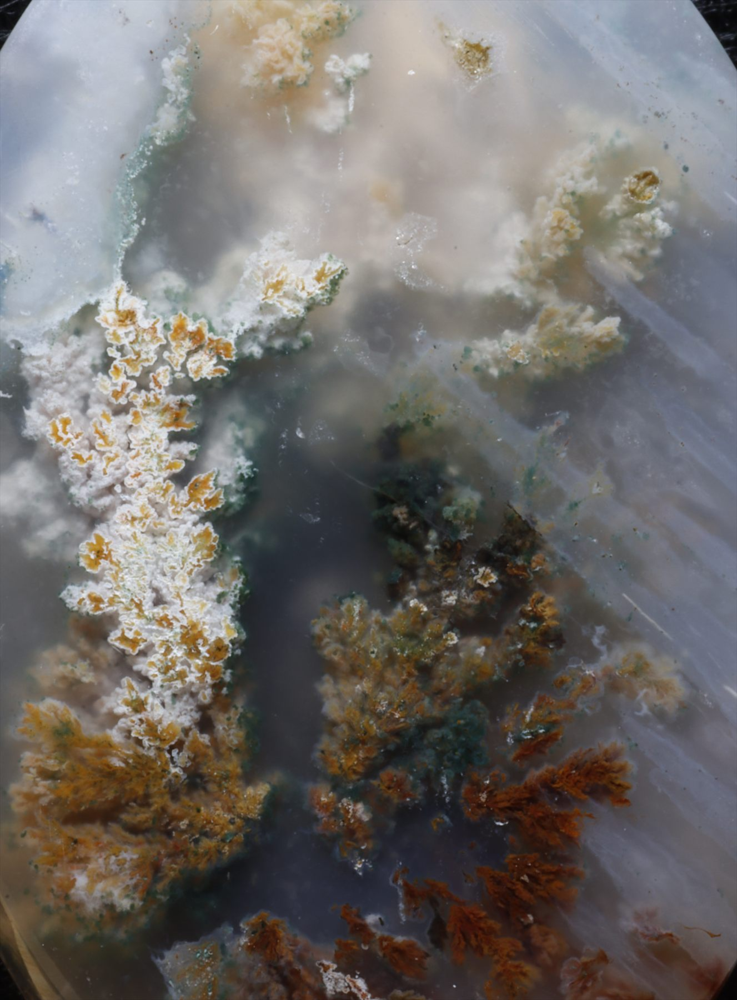
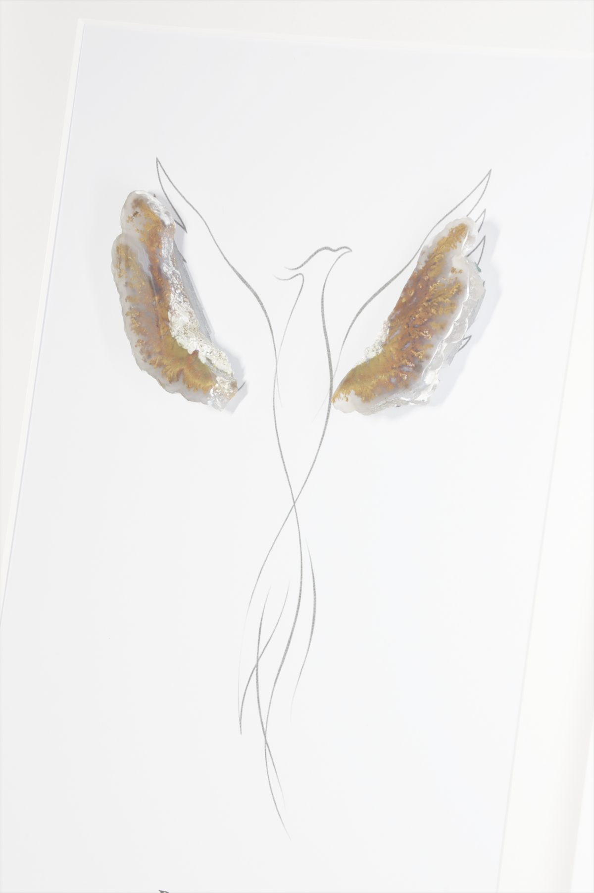

# Rosino — Natural Stones & Artworks

Rosino is a responsive, multi-page portfolio and catalogue website for a Cologne-based natural-stone and artwork brand. The experience presents one-of-a-kind stones, framed compositions, and collaboration options for designers and brands through a restrained, gallery-inspired interface.

> This is a portfolio-safe edition of the project. Product imagery has been web-optimized with metadata removed, while production certificates, backup files, and business-specific legal documents are intentionally excluded.

<p align="center">
  
  
</p>

## Highlights

- Responsive layout for desktop, tablet, and mobile
- Dedicated collection, artwork, product-detail, about, contact, and legal pages
- Image galleries with an interactive lightbox
- Client-side catalogue pagination
- Mobile navigation with an animated menu control
- GDPR-conscious cookie-consent interface
- English and German legal information
- Custom favicon and web-app manifest
- No framework or build step required

## Portfolio Edition

- Preserves the complete interactive front-end experience
- Uses optimized web images instead of original high-resolution masters
- Removes embedded camera metadata from published imagery
- Replaces downloadable authenticity documents with request-only notices
- Uses a portfolio demonstration notice instead of production legal information
- Keeps the original production project and its history separate

## Built With

- Semantic HTML5
- Modern CSS, including Grid, Flexbox, transitions, and responsive breakpoints
- Vanilla JavaScript
- Google Fonts — Montserrat
- Osano Cookie Consent, loaded from jsDelivr

## Project Structure

```text
.
├── assets/
│   └── images/             # Optimized brand, collection, product, and artwork imagery
├── index.html              # Main landing page
├── collection.html         # Natural-stone catalogue
├── artworks.html           # Framed artwork catalogue
├── legal.html              # Portfolio, privacy, cookie, and usage notice
├── style.css               # Shared visual system and responsive layouts
├── script.js               # Navigation, consent, lightbox, and pagination
└── site.webmanifest        # Web-app metadata
```

## Run Locally

The website is completely static. Clone or download the repository, then serve the project directory with any local web server.

```bash
python -m http.server 8000
```

Open `http://localhost:8000` in a browser. Opening `index.html` directly also works for most pages, but a local server gives behavior closer to production hosting.

## Deployment

The project can be hosted directly with GitHub Pages:

1. Open the repository's **Settings → Pages**.
2. Under **Build and deployment**, select **Deploy from a branch**.
3. Select the default branch and the `/ (root)` folder.
4. Save and wait for the public URL to become available.

## Portfolio Notes

This repository demonstrates the complete design and front-end implementation of the Rosino website, including information architecture, responsive behavior, product presentation, gallery interactions, and a portfolio-safe legal notice. Production-only documents and original-resolution source assets are not part of this public edition.

## Usage and Rights

This project is published as a portfolio work. The Rosino name, visual identity, written content, product imagery, certificates, and source code are all rights reserved unless permission is granted by their respective owner. No reuse or redistribution is permitted without prior written permission.
